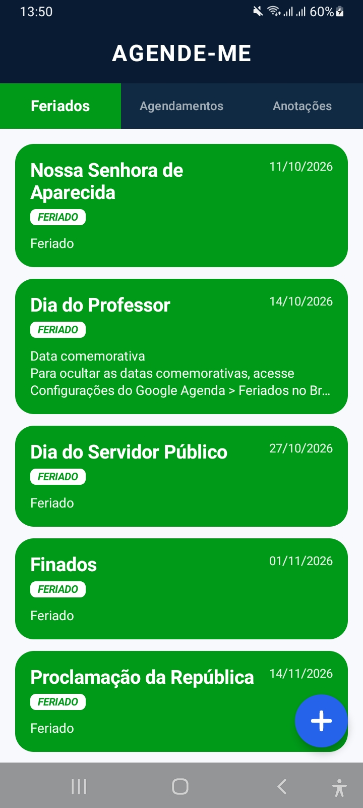
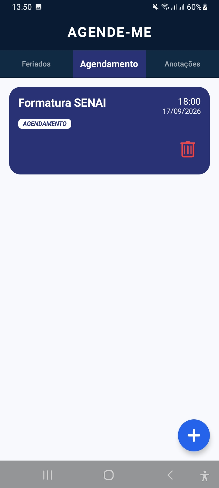
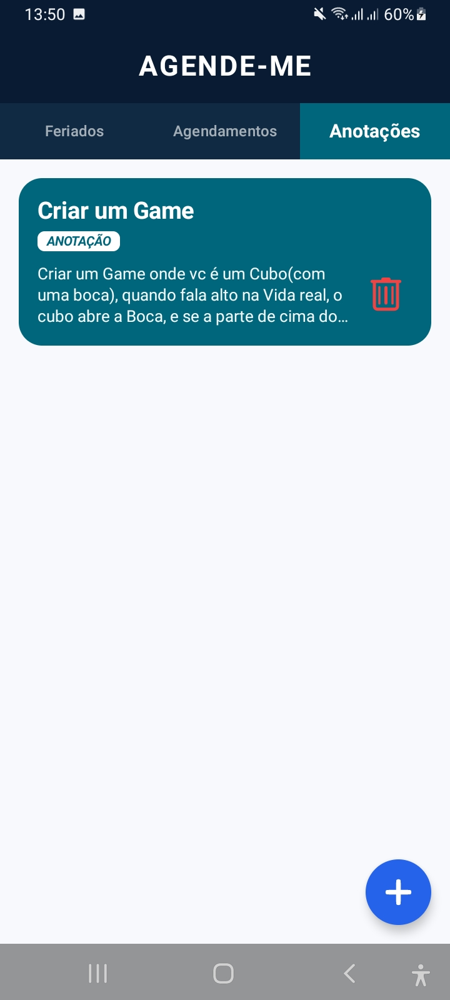
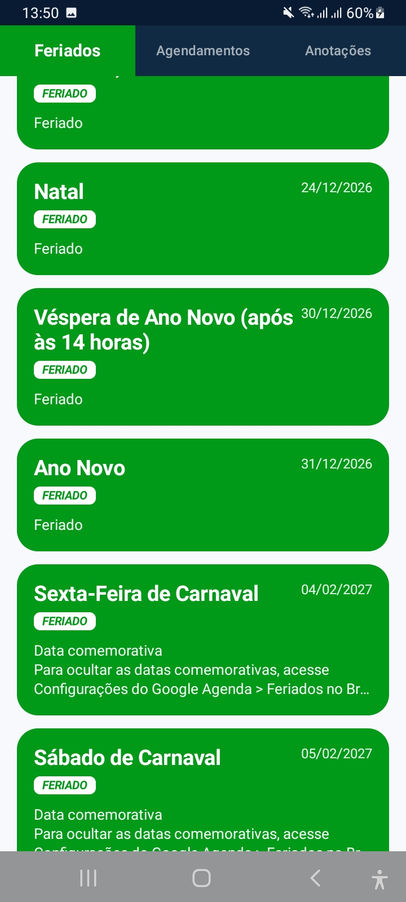
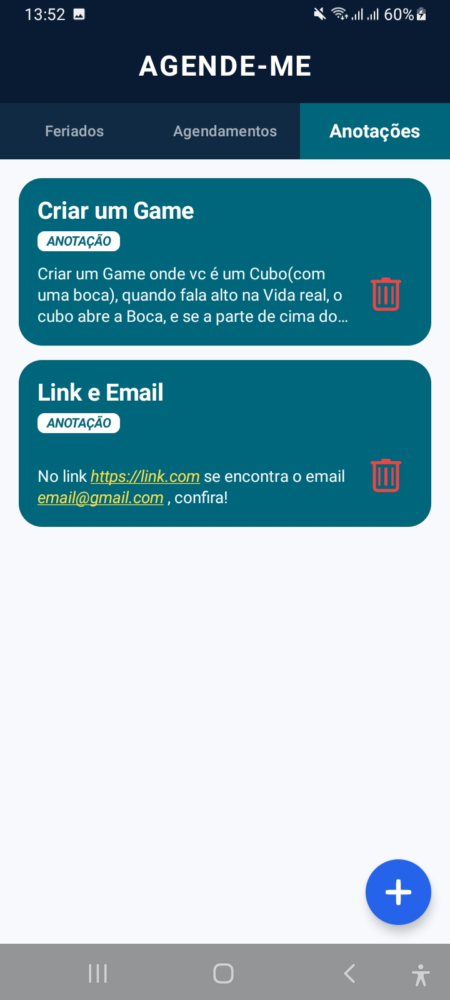
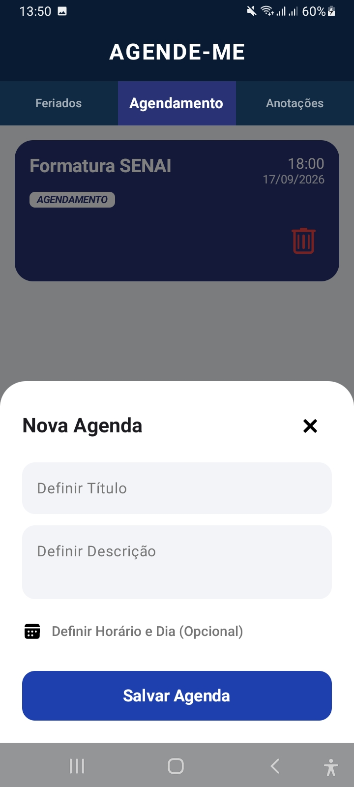
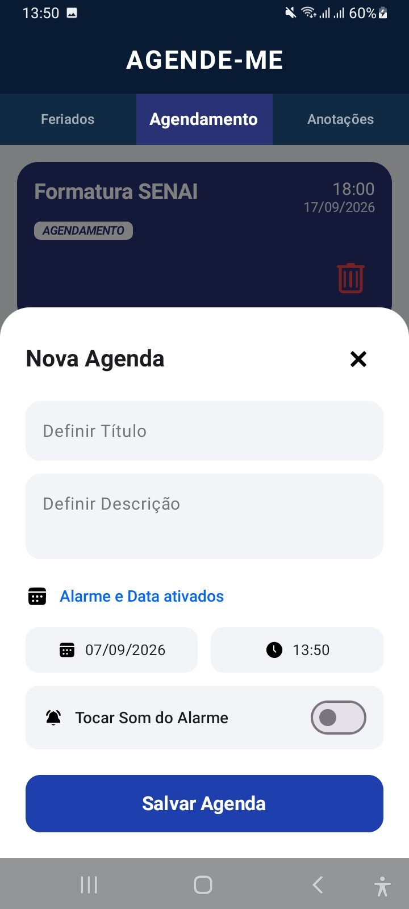
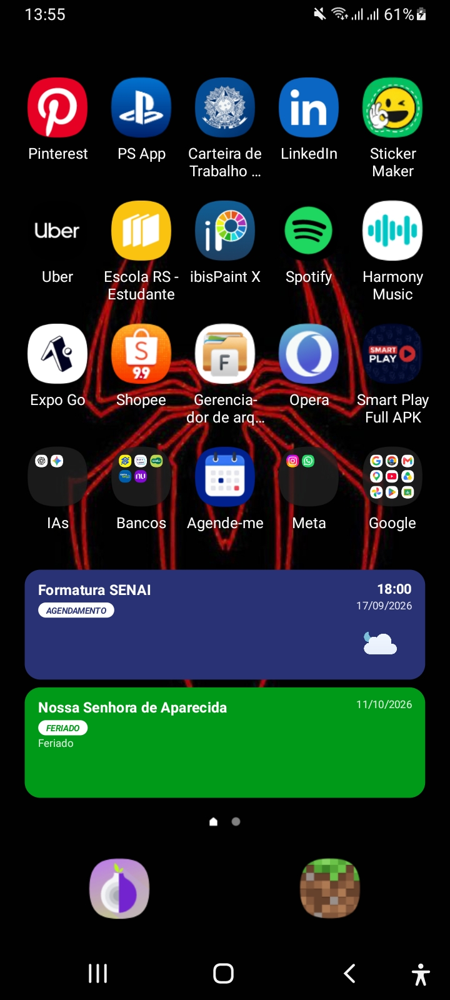

# Agende-me


Aplicativo Android para organizar agendamentos, consultar feriados da agenda do dispositivo, criar anotações rápidas e receber lembretes por notificação. O app também disponibiliza um widget para a tela inicial com os dois próximos itens e seus respectivos ícones de clima.


## Visão geral


O Agende-me possui uma interface em Jetpack Compose dividida em três abas:


1. **Feriados**: exibe eventos identificados como feriados nas agendas sincronizadas do aparelho.

2. **Agendamentos**: exibe os demais eventos da agenda nativa, ordenados por proximidade.

3. **Anotações**: exibe textos salvos somente dentro do aplicativo, sem criar um evento no calendário do Android.


O cabeçalho permite trocar de aba com navegação horizontal. As listas possuem rolagem independente, animações de entrada e espaçamento entre os cards. Ao rolar uma lista, o cabeçalho e o botão de ação reduzem sua presença para preservar espaço útil.


## Funcionalidades


### Criar agendamento ou anotação


O botão de ação flutuante abre um painel inferior para criação de conteúdo. O painel possui:


- campo de título;

- campo de descrição;

- opção para ativar data e horário;

- seletor de data;

- seletor de horário no formato `HH:mm`;

- opção para emitir som no lembrete;

- botão para salvar;

- botão para fechar o painel.


O comportamento depende da data:


- com data definida, o item é criado na agenda principal do Android e aparece na aba **Agendamentos**;

- sem data, o item é salvo como anotação local e aparece na aba **Anotações**.


### Cards de agendamento


Cada card de agendamento mostra título, descrição, data e horário quando disponíveis. O conteúdo pode ser expandido com um toque. Um toque longo copia a descrição para a área de transferência e produz uma vibração curta.


O botão de exclusão pede confirmação antes de remover o evento. A exclusão é feita na agenda nativa; quando concluída, o lembrete correspondente também é cancelado.


### Cards de feriado


Os feriados são exibidos em cards próprios, com identidade visual diferente dos agendamentos. Eles são lidos da agenda do dispositivo e também podem ser reconhecidos por calendários configurados como feriados ou por títulos classificados como feriado.


### Cards de anotação


Anotações não possuem data nem horário. Elas são armazenadas em `SharedPreferences` usando JSON e podem ser excluídas diretamente pelo card.


### Lembretes e notificações


Quando um agendamento possui data e horário futuros, o app cria um alarme exato por meio do `AlarmManager`. No momento definido, o `AlarmReceiver` exibe uma notificação.


Existem dois canais de notificação no Android 8 ou superior:


- **Lembretes Silenciosos**: sem som;

- **Lembretes com Som**: alta importância, vibração e som padrão de alarme.


O canal é escolhido de acordo com a opção de som marcada durante a criação. Datas que já passaram não são agendadas.


### Widget da tela inicial


O widget `ScheduleWidget` mostra dois cards:


- o evento mais próximo;

- o próximo evento, priorizando inicialmente um tipo diferente do primeiro quando houver essa opção.


Cada card possui título, tipo, data, horário, descrição e seu próprio ícone de clima. O widget pode ser redimensionado horizontal e verticalmente e abre o aplicativo ao ser tocado.


Os dados exibidos no widget são persistidos separadamente em `SharedPreferences`. Quando a agenda é atualizada, o widget recebe primeiro os dados existentes e depois é atualizado novamente com os ícones de clima.


## Clima


O clima é consultado na API Open-Meteo para as coordenadas padrão de São Paulo:


- latitude: `-23.5505`;

- longitude: `-46.6333`.


O repositório de clima escolhe uma previsão em blocos fixos de seis horas:


| Horário do evento   | Previsão consultada |

| ------------------- | ------------------- |

| `00:00` até `05:59` | `00:00`             |

| `06:00` até `11:59` | `06:00`             |

| `12:00` até `17:59` | `12:00`             |

| `18:00` até `23:59` | `18:00`             |


O ícone usa a condição meteorológica retornada pelo código WMO e respeita o período do dia:


- `06:00` até `17:59`: variantes `day`, com Sol;

- `18:00` até `05:59`: variantes `night`, com Lua.


Os SVGs são obtidos da versão estática dos Meteocons:


```text

https://cdn.meteocons.com/3.0.0-next.10/svg-static/fill/{icone}.svg

```


O SVG é convertido para PNG antes de ser exibido pelo Glance. O arquivo é salvo no armazenamento interno do aplicativo. Quando existe internet, o cache é atualizado; se a conexão falhar, o último PNG válido continua sendo utilizado.


## Permissões


O aplicativo solicita as permissões necessárias durante a inicialização:


- `READ_CALENDAR`: ler eventos e feriados da agenda;

- `WRITE_CALENDAR`: criar e remover agendamentos;

- `POST_NOTIFICATIONS`: exibir notificações no Android 13 ou superior;

- `SCHEDULE_EXACT_ALARM` e `USE_EXACT_ALARM`: agendar lembretes exatos;

- `INTERNET`: consultar a previsão e baixar os ícones;

- `VIBRATE`: fornecer feedback ao copiar uma descrição com toque longo.


Sem acesso de leitura e escrita ao calendário, os eventos da agenda não são carregados e novos agendamentos não podem ser criados corretamente. Anotações locais continuam independentes da agenda.


### Principais modelos


- `HolidayItem`: feriado vindo da agenda;

- `ScheduleItem`: agendamento, incluindo o ID do evento na agenda nativa;

- `AnnotationItem`: anotação local;

- `AppEvent`: representação serializável usada pelo widget;

- `EventType`: diferencia feriado, agendamento e anotação no widget.


### Fluxo de carregamento


1. `MainActivity` inicia o conteúdo Compose.

2. `App` cria os canais de notificação e carrega anotações locais.

3. O app solicita permissões de calendário e notificação quando necessário.

4. `CalendarHelper` consulta eventos dos próximos seis meses.

5. Os eventos são separados entre feriados e agendamentos.

6. `WidgetStorage` salva os eventos e busca os ícones de clima em segundo plano.

7. O `ScheduleWidget` é invalidado para refletir os dados mais recentes.


## Persistência


O aplicativo utiliza diferentes formas de armazenamento:


- **Agenda do Android**: fonte dos agendamentos e feriados, por meio de `CalendarContract`;

- **SharedPreferences de anotações**: JSON local de `AnnotationItem`;

- **SharedPreferences do widget**: JSON local de `AppEvent`;

- **armazenamento interno do app**: PNGs de clima em `weather-icons/static`;

- **controle de exclusão**: IDs removidos são registrados para evitar que eventos excluídos reapareçam durante a sincronização.


## Tecnologias


- Kotlin;

- Jetpack Compose e Material 3;

- AndroidX Activity, Core e Lifecycle;

- Jetpack Glance AppWidget;

- Retrofit 2 com Gson;

- AndroidSVG para renderização dos Meteocons;

- APIs Android `CalendarContract`, `AlarmManager` e `NotificationManager`.


## Requisitos de desenvolvimento


- Android Studio com suporte a Kotlin e Gradle;

- JDK compatível com a versão do Android Gradle Plugin instalada;

- Android SDK configurado;

- dispositivo ou emulador com API mínima 24;

- conexão com a internet para previsão meteorológica e ícones.


O projeto define `minSdk = 24`, `targetSdk = 37` e `compileSdk = 37`.


## Instalação do widget


1. Instale o aplicativo no dispositivo.

2. Mantenha pressionada uma área vazia da tela inicial.

3. Abra a lista de widgets.

4. Procure por **Agendamentos e Feriados**.

5. Adicione o widget e redimensione conforme necessário.


O widget pode aparecer vazio até que o aplicativo consiga ler a agenda e realizar a primeira atualização.


## Limitações conhecidas


- O clima usa coordenadas fixas por padrão; não há seleção de cidade na interface atual.

- A previsão é solicitada para a data do evento e para um dos quatro horários de referência.

- Eventos da agenda são consultados a partir do início do dia atual até seis meses à frente.

- O widget depende dos dados persistidos pelo aplicativo e pode precisar de uma atualização após a instalação.

- Notificações podem ser limitadas pelo fabricante do dispositivo, pelo modo de economia de bateria ou pelas configurações do sistema.

- O Android pode exigir autorização específica para alarmes exatos em determinadas versões e fabricantes.

- Sem internet, um ícone previamente salvo pode ser exibido, mas uma condição nunca consultada antes não terá imagem disponível.


## Solução de problemas


### Nenhum evento aparece


Verifique se as permissões `READ_CALENDAR` e `WRITE_CALENDAR` foram concedidas e se existe uma agenda visível configurada no dispositivo.


### O agendamento não gera notificação


Confirme que a data e o horário estão no futuro, que `POST_NOTIFICATIONS` está permitido e que o sistema não bloqueou alarmes exatos ou execução em segundo plano.


### O widget não mostra clima


Abra o aplicativo com internet, aguarde a atualização dos eventos e confira se o evento possui data válida. O primeiro download de cada ícone pode levar alguns segundos.


### A versão release fecha ao abrir


Gere o APK com um JDK compatível, verifique o logcat do dispositivo e confirme que as regras de R8 de `app/src/main/keepRules/rules.keep` estão sendo incluídas pelo build release.


## Estrutura de recursos visuais


Os recursos XML em `app/src/main/res/drawable` definem ícones de ações e fundos dos cards do widget. Os arquivos em `res/values` concentram cores, tema e textos reutilizados pelo aplicativo. O ícone meteorológico não é empacotado como recurso Android: ele é baixado, convertido e armazenado no cache interno em tempo de execução.


## Imagens do App


<p align="center">
  
  
  
</p>

<p align="center">
  
  
  
</p>

<p align="center">
  
  
</p>

<p align="center">
  
  
  
</p>

<p align="center">
  
  
  
</p>

<p align="center">
  
  
</p>


## Licença


App criado por Arichel dos Santos Moron - Não possui lincença de comercialização. 
